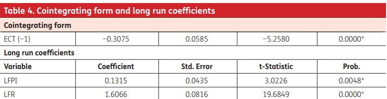
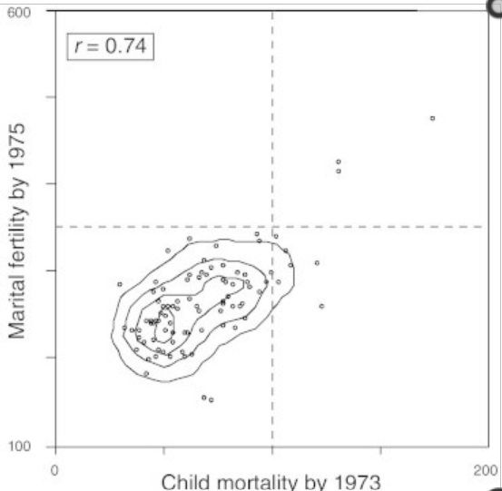
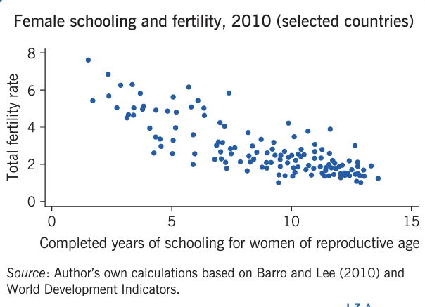
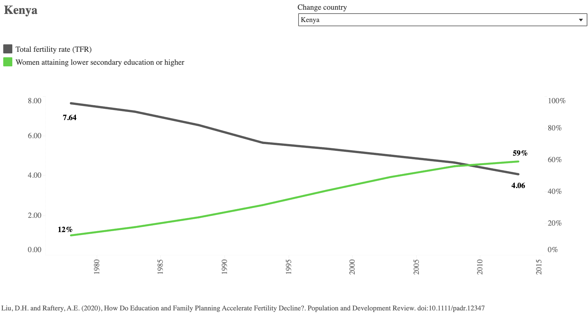

<!-- <style> -->
<!-- .main-container { -->
<!--     max-width: 1940px; -->
<!--     margin-left: 0; -->
<!--     margin-right: 0; -->
<!-- } -->
<!-- </style> -->

# Executive Summary
The study delves into the intriguing relationship between child mortality rates and maternal fertility rates, examining whether correlation demonstrates causation. Notably, there was a moderately strong correlation between these two variables, possibly hinting at a causative link. The competition and contagion hypothesis postulates that increased child mortality may result from factors like disease transmission and resource competition among offspring. However, the study discovered confounding factors that may influence maternal fertility rate, highlighting the intricate interaction between confounding factors and fertility rates. 

Furthermore, another study explored how the percentage of girls completing primary school in Colombia affected fertility rates. Correlation coefficient and linear regression analysis revealed a clear negative correlation, consistent with credible secondary data from the University of Washington. The study demonstrated strong correlation, however could not isolate other confounding variables to illustrate causation. Gapminder, a highly reliable and credible website was used as the source of data collection. 


<br>

# Initial Data Analysis

## Source
In this study, Gapminder was used. Gapminder is a website that extensively utilises data sets obtained from the United Nations World Population Prospects (2022) report for its data collection purposes. The United Nations World Population Prospects (2022) is a highly credible organisation that portrays global trends such as population’s distribution of age and sex, as well as mortality rates, fertility rates and international migration. This data collection spans the 1950s to the present, with projections out to 2050. 

Additionally, the data for life expectancy was collected from Global Burden of Disease Study, IHME (2017), another highly reliable and credible organisation. 

### Limitations
The extrapolated data provided by The World Population Prospects is not reliable, as global trends in the future may not follow the current worldwide trends. Furthermore, the extrapolated data fails to consider unprecedented events such as natural disasters, economic crises, and other irregularities (United Nations, 2019).As a result, these extrapolation sets were removed from the data set. Furthermore, data collected from developing countries are less reliable, as the lack of civil registration systems can introduce confounding or bias factors that impact the quality of the collected data. 
<br> <br>
Key confounding or bias factors include: 
<br>
<ol>
<li>
Marginalised and isolated communities does not have access to registration systems, therefore data from these demographics are not obtained
\li
<li>
Political instability in developing countries introduces a significant source of potential bias, as data may be subject to manipulation or distortion in favour of politicians or government in power
\li
\ol

### Stakeholders
It is important to note that Gapminder is an independent, non-profitable organisation that receives funding from the government and charities such as the Bill and Melinda Gates Foundation (Supporters | Gapminder, n.d.). As a result, Gapminder does not have any political, religious or economic affiliations. Therefore, the organisation has no financial incentives to manipulate data, making it a reliable source for data collection. 


## Variables
Five variables were downloaded from Gapminer, and collated into a single CSV file by selecting each row. The data is from the year 1970 to 2023, inclusive. The classification of each variable is shown below.

```{r}
# Setup code
data <- read.csv("data/Colombia.csv")
library("ggplot2")
library(knitr)


# Structure of the data
str(data)
```

### Population (integer)
Independent variable Population: This represents the integer value denoting the total population of the country. The initial dataset included prefixes (e.g., 'k' for thousand and 'M' for million), causing it to be initially categorised as a string variable. However, during the data compilation process, these prefixes were replaced with their respective numerical equivalents.

### Fertility rate (numeric)
The average fertility rate shows the average number of childbirth per woman for that country. A value of two means the population remains constant.

### Child mortality (numeric)
The death of children under five years of age per one thousand births.

### Percentage of girls completing primary school (numeric)
This numerical variable quantifies the enrollment rate in the final grade of primary school by dividing the number of students entering the last grade of primary school by the population of students at that age.

### Life expectancy at birth (numeric)
The number of years a newborn infant is expected to live at the time of their birth.


# How will maternal fertility affect child mortality?
Child mortality rate has been a major issue in modern third world countries, thus we chose to research the possible effects of maternal fertility on child mortality. As this correlation is more clear in less developed countries, we’ve chosen to investigate this relationship in Colombia between the years 1970-2022. A graph of both variables over time is seen in Figure 1. Beginning with a linear regression as seen in Figure 2 there is clearly a strong correlation between child mortality rate and fertility of the mother, seen by the correlation coefficient of 93. As seen in Figure 3 the residual plot of maternal fertility against child mortality, this data is heteroscedastic which suggests that another model may be more suitable to explain this relationship.


```{r}
# Set margins for the graph. Otherwise the 'fertility' label doesn't show.
par(mar = c(5, 5, 2, 5))

# Line graph of Morality in red.
plot(data$Year, data$Mortality, col ="red", type ="l", xlab ="Year", ylab ="Mortality")

# Set up a second y-axis on the right hand side of the plot
# Set the parameter 'new' to true to specify a second line
par(new=TRUE)
# Do not include axis ticks or labels (these are on there from the last plot)
plot(data$Year, data$Fertility, col ="blue", type ="l", xaxt ="n", yaxt ="n", xlab ="", ylab ="")

# Add a legend to differentiate between the two lines
legend("topright", legend = c("Mortality", "Fertility"), col=c("red", "blue"), lty = 1)

# Add a y-axis and label for the second line
axis(4, las = 1)
mtext("Fertility", side = 4, line = 2.5)

# Caption and title
title("Mortality and Fertility Over Time")
mtext("Figure 1: Graph showing morality and fertility rates over time.", side = 1, line = 4, cex = 0.8)


```


```{r}
l <- lm(formula = data$Fertility ~ data$Mortality)


print(l$coefficients)

# # Set the plots up side by side
# par(mfrow=c(1,2))


plot(data$Fertility~data$Mortality, xlab = "Mortality", ylab = "Fertility")
abline(l)

# Caption and title
title("Mortality vs Fertility")
mtext("Figure 2: Graph plotting the mortality rates of Colombia against fertility rates.", side=1, line=4, cex=0.8)
# Axes


plot(data$Mortality, l$residuals, xlab = "Mortality", ylab = "Residuals")
# Caption and title
title("Residuals for Figure 2")
mtext("Figure 3: Residuals for the graph of mortality rates against fertility rates.", side=1, line=4, cex=0.8)

r_squared <- round(summary(l)$r.squared, 4)

print(paste("R-squared value: ", r_squared))

```


Cross-referencing these results with other sources, presents similar ideas of a significant correlation between higher maternal fertility rate and child mortality rate, however data is mostly collected from developing countries such as Ghana, which are more affected by poverty and lack of resources. It can be seen in Table 1 , from the variable LFR (fertility rate) that a 1% increase in fertility rate, will result in a 1.61% increase in infant mortality, thus supporting the data gathered in this report. As seen in Figure 4, the linear regression relating child mortality and fertility shows a moderately strong positive correlation, with a Pearson's Correlation Coefficient of 0.74. Therefore there is an undisputable correlation between child mortality and maternal fertility, as seen through various sources.


 
Table 1 : The effect of fertility rate on child mortality rate in Ghana (Asumadu-Sarkodie. S & Owusu .P.A (2016).



Figure 4 : The relation between child mortality and fertility in Costa Rica (Rosero-Bixby, L., 2005)


However it’s not entirely clear whether or not this is simply correlation or causation in addition to correlation. Pointing to possible causation is the competition and contagion hypothesis, relating to the higher likelihood of infection by disease if being raised among other offspring along with more competition being created for daily necessities such as food and motherly care (Haines, M.R. 1998). This is cited from a reliable source, as it was published within the most recent 25 years and published by The National Academies Press, a highly accredited company.  Further evidence for causation suggests that a higher fertility rate can result in maternal depletion, reducing regularity of lactation, thus the only possible food source of the child is unattainable, consequently leading to higher mortality rates (Rosero-Bixby, L., 2005). Thus it can be said there is a strong correlation between child mortality and maternal fertility, along with a possible causation factor as well.


# How does the percentage of girls who complete primary school affect fertility rates?

A lot of research has been placed in determining whether or not the education rate of women affects the fertility rate within a society. To add to this field of study, we have decided to investigate the correlation between fertility rate and school completion rate for girls in Colombia between 1970 and 2022. This was accomplished by performing a linear regression on these two variables, and, as can be seen in Figure 5, there is a clear negative correlation between them. The aggregate summaries from the linear regression support this, as the correlation coefficient is 0.88. Thus it can be determined that there is a significant correlation between the percentage of girls who complete primary school and the fertility rate of women in Colombia.

```{r}
# Set margins for the graph. Otherwise the 'fertility' label doesn't show.
par(mar = c(5, 5, 2, 5))

# Line graph of Fertility in red.
plot(data$Year, data$Fertility, col ="red", xlab ="Year", ylab ="Fertility")

# Set up a second y-axis on the right hand side of the plot
# Set the parameter 'new' to true to specify a second line
par(new=TRUE)
# Do not include axis ticks or labels (these are on there from the last plot)
plot(data$Year, data$Primary.school.completion, col ="blue", xaxt ="n", yaxt ="n", xlab ="", ylab ="")

# Add a legend to differentiate between the two lines
legend("topright", legend = c("Fertility", "Primary School Completion"), col=c("red", "blue"), lty = 1)

# Add a y-axis and label for the second line
axis(4, las = 1)
mtext("Primary School Completion", side = 4, line = 2.5)

# Caption and title
title("Fertility and primary school completion over time")
mtext("Figure 5: Graph showing fertility and primary school completion over time.", side = 1, line = 4, cex = 0.8)

```
```{r}
# Check for complete cases (rows without missing values)
df <- as.data.frame(data)
complete_rows <- complete.cases(df)

# Create a new data frame with complete cases
data_cleaned <- df[complete_rows, ]

l <- lm(formula = data_cleaned$Fertility ~ data_cleaned$Primary.school.completion)


print(l$coefficients)

# # Set the plots up side by side
# par(mfrow=c(1,2))


plot(data_cleaned$Fertility~data_cleaned$Primary.school.completion, xlab = "Fertility", ylab = "Primary School Completion")
abline(l)

# Caption and title
title("Fertility vs Primary School Completion by Girls")
mtext("Figure 6: A graph showing fertility rates against the percentage of girls who completed primary school.", side=1, line=4, cex=0.8)
# Axes


plot(data_cleaned$Fertility, l$residuals, xlab = "Fertility", ylab = "Residuals")
# Caption and title
title("Residuals for Figure 6")
mtext("Figure 7: Residuals for the graph of fertility rates against primary school completion.", side=1, line=4, cex=0.8)

r_squared <- round(summary(l)$r.squared, 4)

print(paste("R-squared value: ", r_squared))

```




The notion that higher education levels for women negatively affects fertility rate is generally supported by other studies in the field. Ajou university in South Korea performed a similar analysis in February 2016 wherein they compared the average completed years of schooling compared to total fertility rate across multiple countries according to their 2010 consensus (Kim, 2017, pp. 1-3).Their findings can be seen in Figure 8 and align closely with the results found within our linear regression. This is corroborated by the University of Washington’s 2020 study which compares the relationship between fertility rate and the number of women who attained lower secondary education or higher (Eckart, 2020, para 12-14). They found that for almost all developing countries, there was a strong relationship between these two factors (an example graph is provided in Figure 9). 





However, that this correlation does not necessarily imply that higher education rates for women cause a lower fertility rate. There are numerous confounding factors which could influence the seen trend, namely the increasing use of contraceptives and dynamic cultural standards for the role of women in society. These potential confounding factors are discussed in Drake Undergraduate Social Science Journal, where it is ventured that education does in fact partially cause a lower fertility rate (Cornett, 2020, pp 5-9). They attributed this to an effect coined the “quality-quantity tradeoff” whereby the children of educated women had a lower child mortality rate, which in turn reduced the number of children the woman had. Ergo, there is a causational relationship between the education level of women and the fertility rate of society.


# References

Rosero-Bixby, L (2005)  RICA, S. T. I. C. 11 Child Mortality and the Fertility Transition: Aggregated and Multilevel Evidence from Costa Rica. 

Haines, M. R. (1998). The relationship between infant and child mortality and fertility: Some historical and contemporary evidence for the United States. From death to birth: Mortality decline and reproductive change, 227-253. 

Asumadu-Sarkodie, S., & Owusu, P. A. (2016). The casual nexus between child mortality rate, fertility rate, GDP, household final consumption expenditure, and food production index. Cogent Economics & Finance, 4(1) 

Olsen, R. J. (1980). Estimating the effect of child mortality on the number of births. Demography, 17, 429-443. 

Pebley, A. R., & Stupp, P. W. (1987). Reproductive patterns and child mortality in Guatemala. Demography, 24(1), 43-60.

Million Death Study Collaborators. (2010). Causes of neonatal and child mortality in India: a nationally representative mortality survey. The Lancet, 376(9755), 1853-1860. 

Kim, J. (2016) Female education and its impact on fertility: The relationship is more complex than one may think (1st ed.) Ajou University

Eckart, K. (2020) How birth control, girls’ education can slow population growth (1st ed.) University of Washington

Cornett, A. (2020) Analyzing the Relationship Between Female Education and Fertility Rate (1st ed.) Drake Undergraduate Social Science Journal

Supporters | Gapminder. (n.d.). Gapminder Supporters. Retrieved September 22, 2023, from https://www.gapminder.org/about/about-gapminder/supporters/

United Nations. (2019). World Population Prospects - Population Division - United Nations. Un.org. https://population.un.org/wpp/Methodology/
